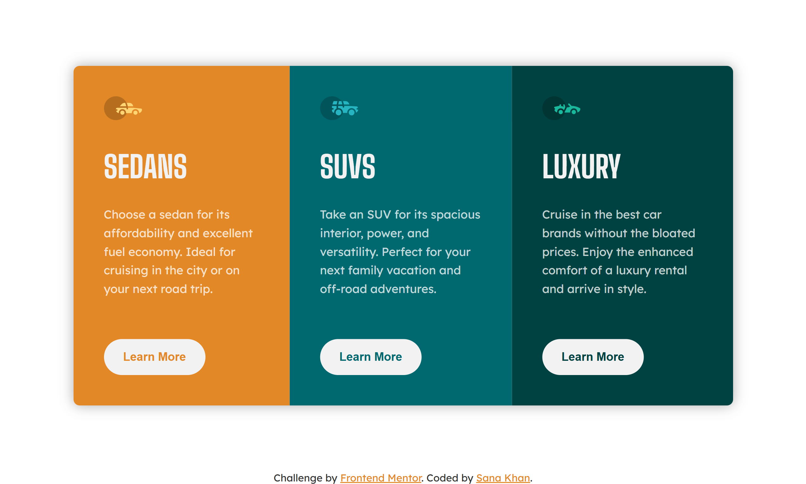

# Frontend Mentor - 3-column preview card component solution

This is my solution to the [3-column preview card component challenge on Frontend Mentor](https://www.frontendmentor.io/challenges/3column-preview-card-component-pH92eAR2-).

## 📄Table of contents

- [Frontend Mentor - 3-column preview card component solution](#frontend-mentor---3-column-preview-card-component-solution)
  - [📄Table of contents](#table-of-contents)
  - [Overview](#overview)
    - [🚀 The challenge](#-the-challenge)
    - [📷 Screenshot](#-screenshot)
    - [🔗Links](#links)
  - [✨My process](#my-process)
    - [⚙️Built with](#️built-with)
    - [🎯Continued development](#continued-development)
  - [👧Author](#author)

## Overview 

### 🚀 The challenge

Users should be able to:

- View the optimal layout depending on their device's screen size
- See hover states for interactive elements

### 📷 Screenshot

### 🔗Links

- Link of Solution:  [Solution URL](https://www.frontendmentor.io/solutions/tridrive-car-category-cards-_Qi4MjYscG)
- Link of live site: [Live site URL](https://sana-zen.github.io/3-Column-Previw-Card/)

## ✨My process

### ⚙️Built with

- Semantic HTML5 markup
- CSS custom properties
- Flexbox
- CSS Grid
- Mobile-first workflow

### 🎯Continued development

- Animations
- Responisiveness & Accessibility
- UI & UX Design

## 👧Author

- Frontend Mentor - [@Sana-zen](https://www.frontendmentor.io/profile/Sana-zen)
- Linkedin - [@Sana-khan10](https://www.linkedin.com/in/sana-khan10)

